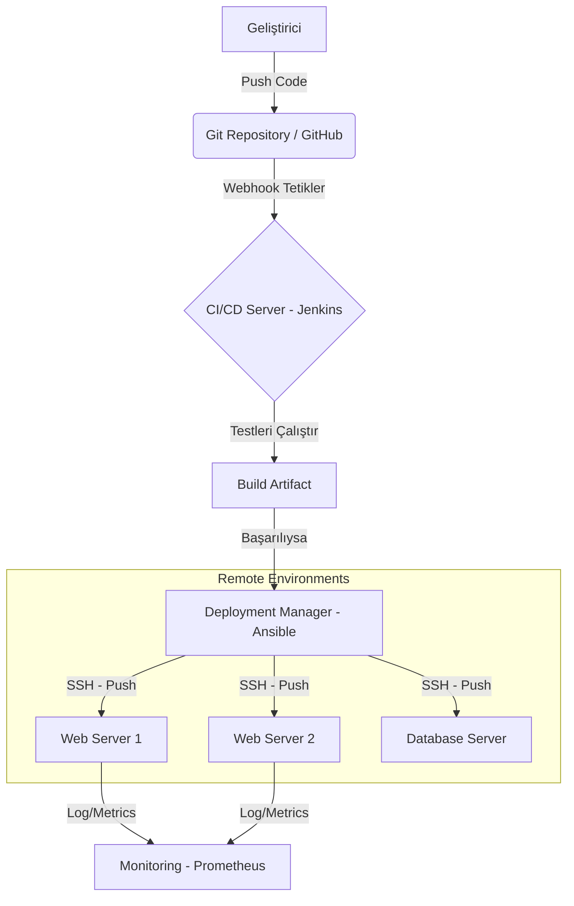

# Research Result for gemini-fast
# Remote Deployment Manager: Derin Teknik Analiz Raporu

## 1. Yönetici Özeti
Remote Deployment Manager (Uzak Dağıtım Yöneticisi), yazılım güncellemelerinin, konfigürasyon değişikliklerinin ve yamaların merkezi bir noktadan birden fazla uzak sunucuya veya uç noktaya (endpoint) güvenli, tutarlı ve otomatik bir şekilde iletilmesini sağlayan sistemlerin genel adıdır. Açık kaynak dünyasında bu süreç genellikle "Infrastructure as Code" (IaC) ve CI/CD (Sürekli Entegrasyon/Sürekli Dağıtım) prensipleriyle yönetilir.

## 2. Temel Mimari ve Çalışma Prensipleri

### 2.1. Push vs. Pull Modeli
* **Push Modeli (Örn: Ansible):** Merkezi bir sunucu, komutları ve kodları uzak sunuculara (node) iter. Genellikle SSH protokolü kullanılır ve uzak sunucuda bir ajan (agent) kurulu olması gerekmez (Agentless).
* **Pull Modeli (Örn: Chef, Puppet, ArgoCD):** Uzak sunuculardaki ajanlar, belirli aralıklarla merkezi sunucuyu kontrol eder ve değişiklik varsa bunları çeker.

### 2.2. Dağıtım Stratejileri
Modern dağıtım yöneticileri, kesinti süresini (downtime) sıfıra indirmek için çeşitli stratejiler kullanır:
* **Blue/Green Deployment:** İki özdeş ortam (Mavi ve Yeşil) kullanılır. Trafik birinden diğerine anlık olarak kesilerek geçiş yapılır.
* **Canary Deployment:** Güncelleme önce küçük bir kullanıcı kitlesine (%5-10) açılır, sorun yoksa genele yayılır.
* **Rolling Update:** Sunucular sırayla güncellenir, böylece sistemin tamamı asla kapanmaz.

## 3. Öne Çıkan Açık Kaynak Araçlar

| Araç | Tür | Mimari | Dil | Kullanım Alanı |
| :--- | :--- | :--- | :--- | :--- |
| **Ansible** | Konfigürasyon & Dağıtım | Push (Agentless) | Python | Sunucu yönetimi, uygulama dağıtımı |
| **Jenkins** | CI/CD Otomasyonu | Master-Slave | Java | Build ve test süreçlerinin tetiklenmesi |
| **ArgoCD** | Kubernetes Dağıtımı | Pull (GitOps) | Go | Kubernetes kümelerine Git tabanlı dağıtım |
| **Capistrano** | Scripting | Push | Ruby | Web uygulamaları (özellikle Ruby/Rails) |

## 4. Kilit Veri İnfografiği (Mermaid)

Aşağıdaki diyagram, tipik bir Açık Kaynak Uzak Dağıtım akışını göstermektedir:

## 5. Web Sunum Arayüzü (HTML Code)
Bulguları sunmak için hazırlanan modern HTML5 sayfası kodu aşağıdadır:
<!DOCTYPE html>
<html lang="tr">
<head>
    <meta charset="UTF-8">
    <meta name="viewport" content="width=device-width, initial-scale=1.0">
    <title>Remote Deployment Manager Raporu</title>
    
</head>
<body>
    

        <h1>Remote Deployment Manager Analizi</h1>
        
Açık kaynak işletim sistemleri ve sunucu yönetiminde, dağıtım süreçlerinin otomasyonu kritik önem taşır. Bu rapor, modern dağıtım yöneticilerinin mimarisini inceler.

        
        <h2>Temel Stratejiler</h2>
        

            

                <h3>Blue/Green</h3>
                
İki özdeş ortam arasında anlık trafik geçişi sağlayarak kesintiyi önler.

            

            

                <h3>Rolling Update</h3>
                
Sunucuları sırayla güncelleyerek hizmetin sürekli ayakta kalmasını sağlar.

            

            

                <h3>Canary</h3>
                
Risk yönetimi için güncellemeyi önce küçük bir kitleye sunar.

            

        

        <h2>Öne Çıkan Açık Kaynak Araçlar</h2>
        <ul>
            <li><strong>Ansible:</strong> Agentless, Python tabanlı, SSH kullanır.</li>
            <li><strong>Jenkins:</strong> Geniş eklenti desteği ile CI/CD standardı.</li>
            <li><strong>ArgoCD:</strong> Kubernetes için GitOps tabanlı dağıtım.</li>
        </ul>
        
        

            © 2025 Açık Kaynak İşletim Sistemi Projesi | Gemini Fast Research
        

    

</body>
</html>
